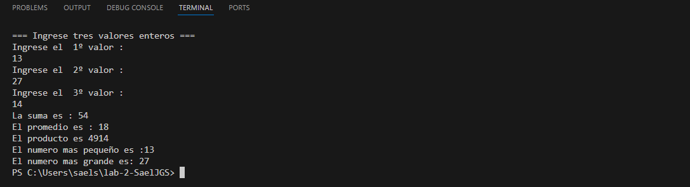

# Ejercicio de laboratorio 1: Suma, Promedio, Máximo y Mínimo

## Descripción

Escriba un programa que lea tres números enteros del teclado e imprima la suma, el promedio, el producto, el más pequeño y el más grande de estos números. El diálogo de la pantalla debería aparecer de la siguiente manera:

```cmd
Ingrese tres enteros diferentes: 13 27 14
La suma is 54
El promedio es 18
El producto es 4914
El más pequeño es 13
El más grande es 27
```

## Contesta las siguientes preguntas

1. Modifique su solución para usar tres declaraciones cin separadas en lugar de una. Escribe un mensaje separado para cada cin.


---

### 2️⃣ ¿Importa si se usa `<` o `<=` al determinar el número más pequeño?

Sí importa.  

- `<` compara si un número es estrictamente menor que otro.  
- `<=` compara si un número es menor o igual que otro.  

En este programa, se usó `<` porque solo necesitamos identificar cuál número es estrictamente el más pequeño.  
No necesitamos considerar igualdad, ya que los números ingresados son diferentes.

---

### 3️⃣ Cambio de tipo de variable para el promedio

Si el promedio se almacena como **entero (`int`)**, el resultado se truncará hacia abajo en caso de que el promedio no sea un número exacto.  

- Por ejemplo, si los números fueran 10, 15 y 20:  
  - Suma = 45  
  - Promedio como `float` o `double` = 15.0  
  - Promedio como `int` = 15 (sin diferencia en este caso)  

- Si los números fueran 10, 11 y 12:  
  - Suma = 33  
  - Promedio como `double` = 11.0  
  - Promedio como `int` = 11 (truncamiento de la parte decimal si existiera)  

**Conclusión:** Cambiar el tipo de la variable a entero puede afectar el resultado si el promedio no es un número exacto. En casos donde la suma no es divisible exactamente entre 3, el valor decimal se pierde al usar `int`.

---


## ✅ Resultado


