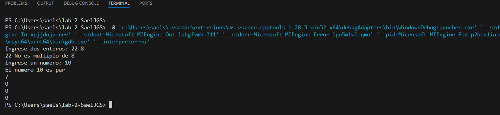

# Ejercicio de laboratorio 2 – Múltiplos

## Descripción

Escriba un programa que lea dos números enteros y determine e imprima si el primero es un múltiplo del segundo.  
**Sugerencia:** use el operador de módulo (`%`).

```cmd
Ingrese dos enteros: 22 8
22 no es un múltiplo de 8
```

---

## Contesta las siguientes preguntas

### 1. ¿Se puede utilizar el operador de módulo con operandos no enteros? ¿Se puede usar con números negativos?  

Supongamos que el usuario ha introducido los siguientes conjuntos de números. Para cada serie, indica el resultado y explica si hay algún error.

| Entero 1 | Entero 2 | Expresión          | Salida| Explicación                                                                                   |
| -------- | -------- | ----------------   | ------| ------------                                                                                  |
| 73       | 22       | `cout << 73 % 22;` | 7     | 73 dividido entre 22 da 3 de cociente y 7 de residuo.                                         | 
| 0        | 100      | `cout << 0 % 100;` | 0     | Cualquier número dividido entre otro (que no sea 0) da residuo 0 si el dividendo es 0.        |
| 100      | 0        | `cout << 100 % 0;` | Error | No se puede dividir ni obtener módulo entre cero, ya que la división por 0 no está definida.  |
| -3       | 3        | `cout << -3 % 3;`  | 0     | El resultado es 0 porque -3 es múltiplo exacto de 3; el signo no afecta.                      |
| 9        | 4.5      | `cout << 9 % 4.5;` | Error | El operador `%` solo funciona con enteros; no se puede usar con decimales.                    |
| 16       | 2        | `cout << 16 % 2;`  | 0     | 16 es divisible entre 2, por lo tanto el residuo es 0.                                        |

**Conclusiones:**
- El operador `%` solo puede usarse con operandos enteros.  
- Sí se puede usar con números negativos.  
- No puede usarse cuando el segundo operando es cero (error de división por cero).  

---

### 2. ¿Qué pasa si colocamos un punto y coma (;) después del final de la expresión de condición de una declaración `if`?

Si se coloca un punto y coma (`;`) inmediatamente después del `if`, se termina la instrucción antes del bloque de código.  
Esto hace que el bloque dentro de las llaves **se ejecute siempre**, sin importar la condición.


### 3. Modifique el programa para determinar si un número ingresado es par o impar.[Nota: Ahora, el usuario necesita ingresar solo un número.]


## ✅ Resultado


